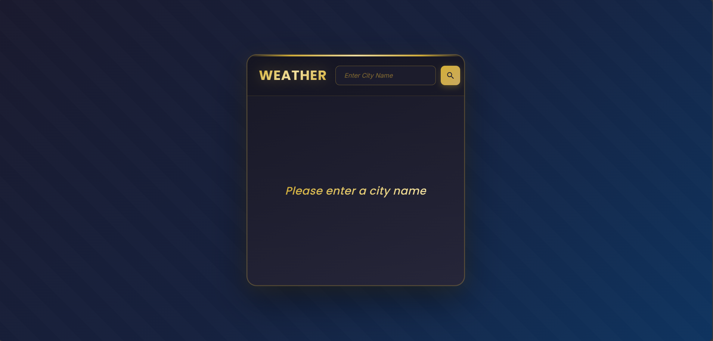
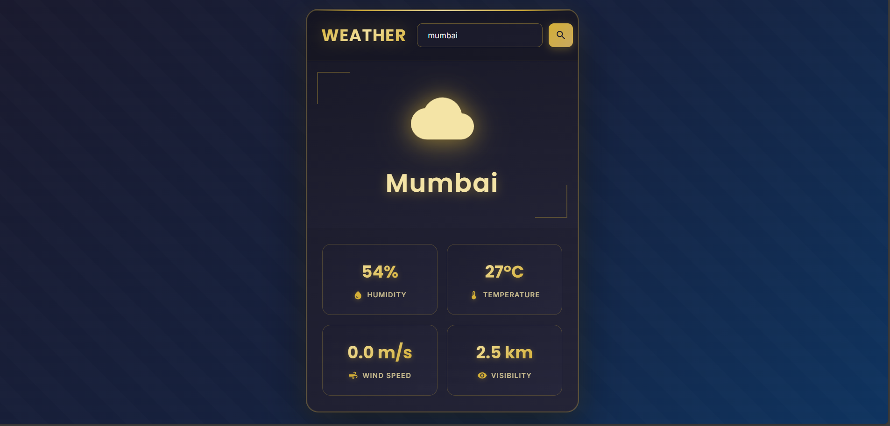
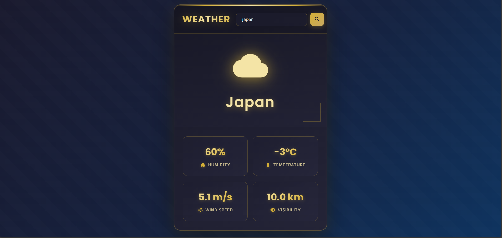

# Weather App

A simple React-based weather application that allows users to search for cities and view weather-related information. This app utilizes the OpenWeatherMap API for geocoding city locations.

## Features

- Search for cities by name
- Display city name and weather metrics (humidity, temperature, wind speed, visibility)
- Responsive UI with Material-UI icons
- Built with React and Vite for fast development

**Note:** Weather data (humidity, temperature, etc.) is currently hardcoded as placeholders. Future updates will integrate real-time weather data from the OpenWeatherMap API.

## Screenshots
   
   
   

## Technologies Used

- **React**: Frontend library for building the user interface
- **Vite**: Build tool for fast development and bundling
- **Material-UI**: Icon library for weather-related icons
- **OpenWeatherMap API**: For geocoding city locations

## Installation

1. Clone the repository:
   ```
   git clone <repository-url>
   cd wheather-app
   ```

2. Install dependencies:
   ```
   npm install
   ```

3. Obtain an API key from [OpenWeatherMap](https://openweathermap.org/api) and replace the placeholder in `src/App.jsx`:
   ```javascript
   const ApiKey = 'your-api-key-here';
   ```

4. Start the development server:
   ```
   npm run dev
   ```

5. Open your browser and navigate to `http://localhost:5173` (or the port specified by Vite).

## Usage

- Enter a city name in the search input.
- Click the search icon to fetch and display the city information.
- View the weather metrics displayed below (currently placeholders).

## Scripts

- `npm run dev`: Start the development server
- `npm run build`: Build the app for production
- `npm run lint`: Run ESLint for code linting
- `npm run preview`: Preview the production build

## Contributing

Feel free to submit issues and pull requests. For major changes, please open an issue first to discuss what you would like to change.

## License
This project is made by V3nom with 🩷
This project is licensed under the MIT License.
